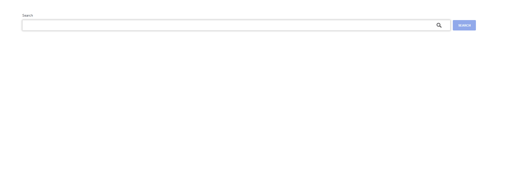

# Overview

From a code challenge:

Create an auto-suggest input field where the user would type at least 3 letters of
a Hacker News story title and display the available stories in a dropdown list.

- Use HackNews API
- Render recorative search button

## Demo

Live: https://manos-liakos.dev/hackernews-autocomplete/

## Features

- Fetches and displays the first 20 stories from HackerNews (https://hn.algolia.com/api)., sorted by relevance.
- Displays points, author and comments for each story.
- Uses custom debouncing hook to limit requests.
- Implements simple caching mechanism using the localStorage API. Each keyword:results pair is stored.
- Results arrow navigation.

## Installation

### Using the development build

1. Download and install the latest LTS version of Node.js.
2. Open a terminal in "problem_2" directory and run 'npm install', to install all the necessary node modules.
3. When finished run 'npm start' to start the development server.
4. Open a browser and visit 'localhost:3000'.

### Using the production build

1. Open a terminal in "problem_2" directory and run "npm run-script build".
2. Once project building is finished, run "npm install -g serve" to install a local static file server.
3. Run "serve -s build" to start the app.
4. Visit localhost:5000 (see instructoins in terminal).
